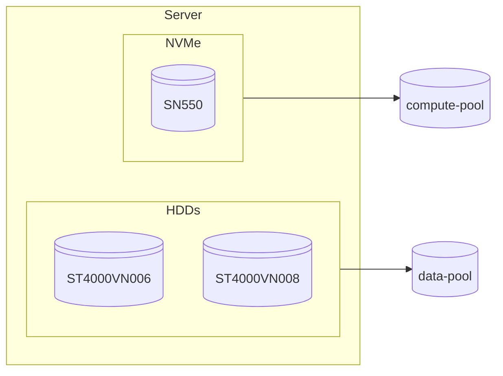
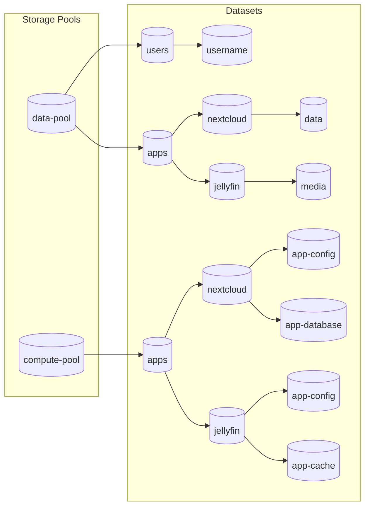

# **KB01** Things To Do After Installing TrueNAS

!!! warning annotate "To acknowledge"

    This procedure is based on my own **experimentation** and should not be used as-is in production environment.  
    
    **No support will be provided for this procedure.**

## Networking

### Configuring Hostname and Domain

???+ info

    If you don't have a local domain name, keep the **Domain** field set to the default value `local`.

1. Navigate to **Network**, click **Settings** to access the **Edit Global Configuration** menu.

1. Update values in the **Hostname** and **Domain** fields.

    ```
    Hostname: nas
    Domain: bunbun.ovh
    ```

1. (_Optional_) Untick **NetBIOS-NS** and **WS-Discovery** checkboxes.

    ```
    [ ] NetBIOS-NS
    [x] mDNS
    [ ] WS-Discovery
    ```

1. In the **Nameserver 1**, **Nameserver 2** and **Nameserver 3** fields, enter the IP addresses of your DNS servers.

    ```
    Nameserver 1: 192.168.1.251
    Nameserver 2: 9.9.9.9
    Nameserver 3: 149.112.112.112
    ```

1. Click **Save**.

As, I only have Apple devices on my network, I prefer to disable unnecessary service announcements.

### Setting a Static IP Address

An IP reservation configured on the DHCP server does not exclude the occurrence of a network incident.

1. Navigate to **Network**, select the appropriate network interface and click **Edit** :material-pencil:.

1. Disable **DHCP** to enable manual entry in the Aliases fields.

    ```
    [ ] DHCP
    ```

1. (_Optional_) Disable **Autoconfigure IPv6** if it is not in use.

    ```
    [ ] Autoconfigure IPv6
    ```

1. Click **Add** and then enter the IP address and CIDR values.

    ```
    192.168.1.250/24
    ```

1. Click **Save**. You can skip `Register Default Gateway` step if no changes were made.

1. Click **Test Changes** if the configuration is valid, click **Save Changes** to apply permanently.

## Storage

### Creating Storage Pools



1. Navigate to **Storage** and click **Create Pool** to access the **Pool Creation Wizard** menu.

1. Under the **General Part** section, fill in the following:

    ```
    Name: data-pool
    [x] Encryption
    Encryption Standard: AES-256-GCM
    ```

1. Click **Next** to proceed.

1. In the **Data** section, define the pool layout and disk configuration.

    ```
    Layout: Mirror
    Disk Size: 4 TiB (HDD)
    Width: 2
    Number of VDEVs: 1
    ```

1. Click **Save and Go To Review** and then confirm by clicking **Create Pool**.

1. After creation, download the **Encryption Key** and store it in a secure location. This key is required to unlock the pool.

For the single NVMe drive, I followed the same procedure, selecting the `Stripe` layout and omitting encryption, as the pool is not intended to store sensitive data.

### Creating Datasets



1. Navigate to **Datasets**, select the target storage pool, then click **Add Dataset** to initiate the creation process.

    ```
    Parent Path: data-pool
    Name: apps
    Dataset Preset: Generic
    ```

1. Click **Save** to provision the new dataset.

Repeat the dataset creation process for each additional dataset in the configuration.

## Security

### Creating a New Admin Account

???+ warning
    Enable the **Allow all sudo commands** option only if you need administrative privileges for some tasks. Leave it disabled to adhere to the principle of least privilege.

1. Navigate to **Credentials**, click **Users** and then click **Add** to begin creating a new user.

1. Under the **Identification** section, fill in the following:

    ```
    Full Name: Thanh VO
    Username: svr00m
    Password: <strong_password>
    Confirm Password: <same_strong_password>
    ```

1. In the **User ID and Groups** section, assign to the `builtin_administrators` group.

    ```
    Auxiliary Groups: builtin_administrators
    ```

1. Under the **Directories and Permissions** section, set the user's home and public SSH Key.

    ```
    Home Directory: /mnt/data-pool/users/<username>
    Authorized Keys: <public_ssh_key>
    ```

1. Click **Save** to create the administrator account.

### Disabling the Default Admin Account

???+ danger

    Ensure the new administrator account has been created, tested, and granted equivalent privileges before disabling the default admin account.

1. Navigate to **Credentials**, click **Users** and then click **Edit** :material-pencil: on `truenas_admin` user.

1. Under the **Authentication** section, tick **Lock User** checkbox to disable the account.

1. Click **Save** to apply the change.

### Enabling Two Factor Authentication

1. Go to **System**, click **Advanced Settings** and then click **Configure** under **Global Two Factor Authentication**.

1. Enable the following options to activate 2FA system-wide: 
    - Enable Two Factor Authentication Globally 
    - Enable Two Factor Authentication for SSH

1. Click **Save**, then follow the prompts to register the 2FA token using your preferred authenticator app (e.g. 2FAS, Aegis).